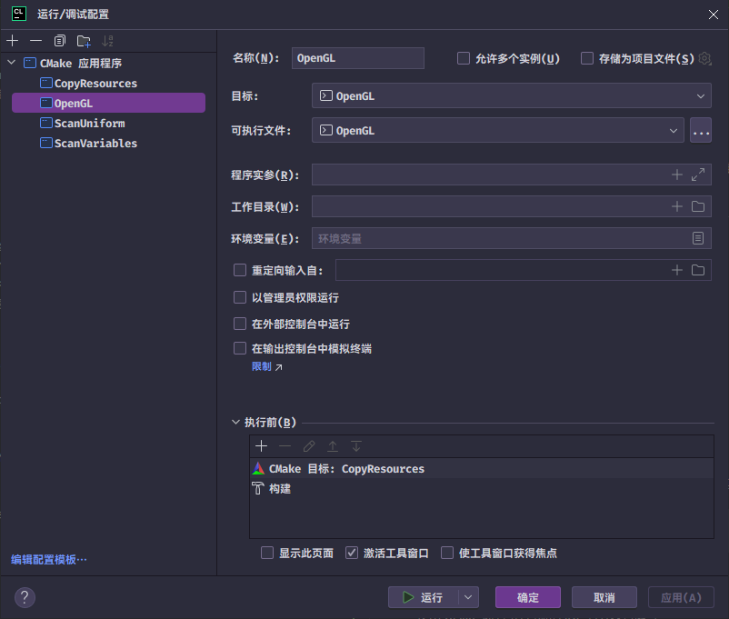

# LearnOpenGL-Mingw-w64

## 描述
&emsp;&emsp;本项目为 **LearnOpenGL** 教程提供了基于 **Mingw-w64** 工具链的 Windows 开发环境和代码示例，旨在帮助学习者在 **CLion** 中轻松学习 **LearnOpenGL** 教程。

---

## 快速开始

### 1. 前置条件
&emsp;在开始之前，请确保你的系统已安装以下工具：
* **[Mingw-w64](https://github.com/niXman/mingw-builds-binaries/releases)**：一个用于 Windows 的 C/C++ 工具链。
* **[Python](https://www.python.org/)**：用于运行初始化脚本。
* **[Ninja](https://github.com/ninja-build/ninja/releases)**：一个快速地构建系统。

### 2. 初始化依赖项
&emsp;在项目根目录运行以下命令，脚本将自动配置所有必要地依赖项:
```bash
  python py/init_dependencies.py
```
### 3. 打开项目
&emsp;&emsp;使用 CLion 或任何你喜欢的 IDE 打开项目即可.

### 4. 切换节章
&emsp;&emsp;打开 **CMakeLists.txt** 文件修改双引号的内容为对应的节章名(src 目录下除 lib 文件夹外的所有文件夹名):
```
示例: SET(CHAPTER "light")
```

### 5. 修改默认运行配置
&emsp;&emsp;在**CLion**的运行/调试配置中修改OpenGL的执行前, 将CMake目标 **CopyResources** 插入到构建之前, 以便在每次运行时都将资源文件拷贝到构建目录.


### 6. 工具 ScanVariables
#### 1. 描述
&emsp;&emsp;**ScanVariables** 是本项目的一个子项目, 用于扫描对应节章的 Shader 文件中的所有 Uniform 变量, 并以头文件的形式输出到 **src/lib/include/节章名/Uniform.h**文件中, 以便简化 **Uniform** 变量的设置.
#### 2. 使用
打开终端运行
```bash
  cmake --build "构建目录路径" --target ScanUniform
```
在.cpp文件中引入Uniform.h文件:
```c++
#include <model/Uniform.h>
```
示例:
```c++
lightingShader
            .use()
            .setMat4(uniform.view(view))//设置 uniform 上的 view 为传入的 view, 并返回设置后的 view.
            .setMat4(uniform.projection(projection))
            .setMat4(uniform.model(model))
            .setVec3(uniform.spotLight.position(camera.getPosition()))
            .setVec3(uniform.spotLight.direction(camera.getFront()))
            .setVec3(uniform.viewPos(camera.getPosition()));
lightCubeShader
            .use()
            .setMat4(uniform.projection)//读取 uniform 上的 projection.
            .setMat4(uniform.view);
```
### 7. 开始你的 OpenGL 学习之路 ( =ω= ) .